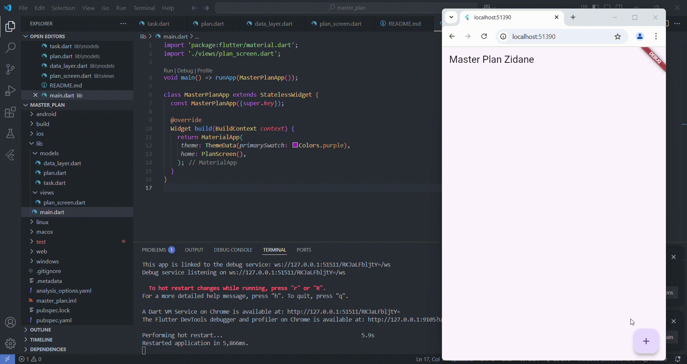

# Laporan Praktikum

Pembuatan Aplikasi To-Do List dengan Flutter

## Praktikum 1

* ### Maksud dari Langkah 4 dan Alasan Dilakukannya
    Langkah 4 bertujuan untuk membuat file data_layer.dart yang mengemas ekspor dari kedua model (plan.dart dan task.dart). Dengan cara ini, proses impor menjadi lebih sederhana karena kita cukup mengimpor data_layer.dart tanpa perlu mengimpor plan.dart dan task.dart

* ### Mengapa Perlu Variabel plan di Langkah 6
    Variabel plan digunakan untuk menyimpan dan mengelola daftar tugas dalam aplikasi. Variabel dibuat sebagai konstanta untuk memastikan bahwa objek Plan bersifat immutable (tidak dapat diubah setelah dibuat) sehingga meminimalisir kemungkinan terjadinya perubahan data yang tidak diinginkan.

* ### Capture Hasil Langkah 9 dan Penjelasan
    
    Penjelasan: Langkah 9 menghasilkan tampilan aplikasi dengan daftar tugas yang dapat diedit. Setiap tugas terdiri dari:
    * Checkbox: Untuk menandai apakah tugas sudah selesai atau belum.
    * TextField: Untuk mengedit deskripsi tugas.
    * ListView: Menampilkan daftar tugas secara dinamis.
    
    Ketika tombol tambah ditekan, tugas baru akan ditambahkan ke daftar. Saat pengguna mencentang checkbox atau mengedit teks, perubahan langsung diperbarui dalam daftar.

* ### Kegunaan Method pada Langkah 11 dan 13 dalam Lifecycle State
    Langkah 11 (initState())
    * Method initState() dipanggil saat widget pertama kali dibuat.
    * Di dalamnya, kita membuat ScrollController dan menambahkan listener untuk menghapus fokus dari semua TextField saat pengguna melakukan scroll.
    * Hal ini berguna terutama di iOS, di mana keyboard dapat menutupi bagian bawah layar.
    
    Langkah 13 (dispose())
    * Method dispose() dipanggil saat widget dihapus dari widget tree.
    * Digunakan untuk membebaskan resource yang tidak lagi digunakan, dalam hal ini ScrollController.
    * Ini penting untuk menghindari memory leak atau masalah performa dalam aplikasi.

## Praktikum 2

* ### Apa yang Dimaksud InheritedWidget pada Langkah 1? Mengapa Menggunakan InheritedNotifier?
    InheritedWidget adalah kelas dasar dalam Flutter yang digunakan untuk mengelola state global dan memungkinkan widget turunannya mengakses data tanpa perlu meneruskannya secara eksplisit.

    Mengapa Menggunakan InheritedNotifier?
    * Efisiensi: InheritedNotifier hanya membangun ulang widget yang mendengarkan perubahan, menghindari build ulang seluruh widget tree.
    * Notifikasi Perubahan: Dengan ValueNotifier, kita dapat mengelola perubahan state secara lebih optimal dibandingkan setState() biasa.
    * Kemudahan Akses Data: Semua widget anak dapat mengambil data tanpa perlu meneruskannya sebagai parameter.

* ### Maksud dari Method di Langkah 3 dan Alasan Dilakukannya
    Method yang ditambahkan dalam plan.dart:
    ```dart
    int get completedCount => tasks.where((task) => task.complete).length;

    String get completenessMessage => '$completedCount out of ${tasks.lenght} tasks';
    ```
    Penjelasan:
    * completedCount: Menghitung jumlah tugas yang telah diselesaikan.
    * completenessMessage: Menghasilkan string yang menampilkan jumlah tugas selesai dibandingkan total tugas.
    
    Mengapa dilakukan demikian?
    * Untuk memberikan umpan balik kepada pengguna mengenai progres penyelesaian tugas.
    * Mempermudah tampilan informasi pada UI tanpa perlu perhitungan tambahan dalam widget.

* ### Capture Hasil Langkah 9 dan Penjelasan
    
    Penjelasan: Aplikasi sekarang menampilkan jumlah tugas yang telah diselesaikan di bagian bawah daftar tugas.
    * Saat pengguna mencentang checkbox, jumlah tugas selesai diperbarui secara otomatis.
    * Menggunakan InheritedNotifier memungkinkan perubahan ini terjadi secara efisien tanpa mempengaruhi seluruh UI.
    * SafeArea memastikan teks tidak tertutup oleh elemen UI lainnya.

## Praktikum 3

* ### Apa yang Dimaksud InheritedWidget pada Langkah 1? Mengapa Menggunakan InheritedNotifier?
    InheritedWidget adalah kelas dasar dalam Flutter yang digunakan untuk mengelola state global dan memungkinkan widget turunannya mengakses data tanpa perlu meneruskannya secara eksplisit.

    Mengapa Menggunakan InheritedNotifier?
    * Efisiensi: InheritedNotifier hanya membangun ulang widget yang mendengarkan perubahan, menghindari build ulang seluruh widget tree.
    * Notifikasi Perubahan: Dengan ValueNotifier, kita dapat mengelola perubahan state secara lebih optimal dibandingkan setState() biasa.
    * Kemudahan Akses Data: Semua widget anak dapat mengambil data tanpa perlu meneruskannya sebagai parameter.

* ### Capture Hasil Langkah 14 dan Penjelasan
    
    Penjelasan: Aplikasi sekarang menampilkan jumlah tugas yang telah diselesaikan di bagian bawah daftar tugas.
    * Saat pengguna mencentang checkbox, jumlah tugas selesai diperbarui secara otomatis.
    * Menggunakan InheritedNotifier memungkinkan perubahan ini terjadi secara efisien tanpa mempengaruhi seluruh UI.
    * SafeArea memastikan teks tidak tertutup oleh elemen UI lainnya.
